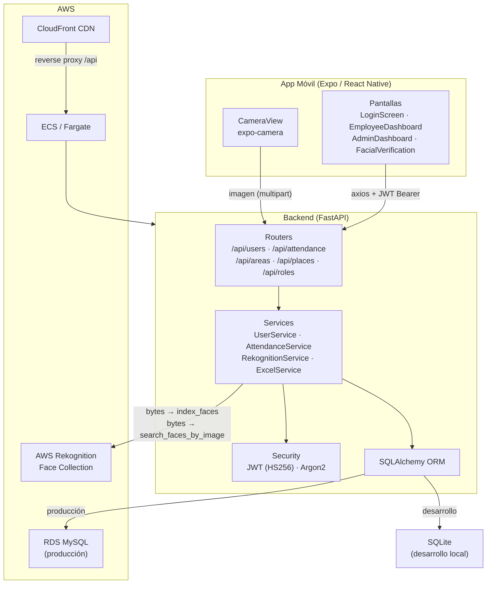

# Facil Rekognition

> Sistema de control de asistencia por reconocimiento facial para empresas.


---

## ¿Qué es esto?

Facil Rekognition es una aplicación móvil + API REST que reemplaza la planilla de asistencia tradicional con verificación biométrica facial. Los empleados fichan entrada y salida capturando su rostro desde la app; el sistema valida la identidad contra AWS Rekognition y registra el turno en la base de datos.

---

## Arquitectura general



---

## Funcionalidades principales

| Feature | Descripción |
|---|---|
| Registro de empleado con rostro | Alta de usuario + indexado de cara en AWS Rekognition |
| Login facial | Identificación biométrica → JWT |
| Login manual | Email + contraseña (Argon2) → JWT |
| Fichaje de entrada | Verificación facial + selección de sede → registro de turno |
| Fichaje de salida | Verificación facial → cierre de turno + cálculo de horas |
| Historial de asistencia | Vista propia del empleado y vista admin por usuario |
| Reporte Excel | Descarga de asistencia filtrada en `.xlsx` con estilos (openpyxl) |
| Gestión de datos maestros | CRUD de Áreas, Sedes (Places) y Roles |
| Roles | `admin` (acceso total) / `employee` (acceso propio) |
| Colección Rekognition | Endpoint admin para crear / eliminar colección en AWS |

---

## Estructura del repositorio

```
facil_rekognition/
├── backend/                  # API Python FastAPI
│   ├── app/
│   │   ├── config/           # Configuración SQLAlchemy (SQLite / MySQL)
│   │   ├── controllers/      # Routers FastAPI (users, attendance, area, place, role, rekognition)
│   │   ├── dependencie/      # Dependencias inyectables (DB session, JWT, roles)
│   │   ├── models/           # Modelos ORM (User, Attendance, Area, Place, Role)
│   │   ├── repositories/     # Capa de acceso a datos
│   │   ├── schemas/          # Schemas Pydantic (request / response)
│   │   ├── security/         # hash_service (Argon2) + token_service (JWT)
│   │   ├── services/         # Lógica de negocio
│   │   └── main.py           # App FastAPI, CORS, registro de routers
│   ├── certs/                # global-bundle.pem (SSL RDS — no es secreto)
│   ├── Dockerfile
│   ├── docker-compose.yml
│   └── requirements.txt
├── frontend/
│   └── face-recognition-app/ # App React Native (Expo)
│       ├── app/              # Rutas expo-router
│       ├── components/       # Pantallas y contextos React
│       ├── functions/        # Cliente axios + funciones por entidad
│       └── styles/           # StyleSheets por pantalla
├── docs/
│   └── ARQUITECTURA.md       # Diagrama de contexto y flujos detallados
├── docker-compose.yml        # Compose raíz (backend)
└── .gitignore
```

---

## Requisitos previos

| Herramienta | Versión mínima |
|---|---|
| Python | 3.11 |
| Node.js | 20+ |
| Docker + Docker Compose | Cualquier versión reciente |
| Cuenta AWS con Rekognition habilitado | — (requerido para reconocimiento facial) |
| Expo Go (teléfono) o emulador | SDK 54 compatible |

---

## Quick start — Backend (SQLite local)

```bash
# 1. Clonar y ubicarse en la rama de desarrollo
git clone <repo-url>
cd facil_rekognition
git checkout facial_dev

# 2. Crear entorno virtual e instalar dependencias
cd backend
python -m venv .venv
source .venv/bin/activate        # Windows: .venv\Scripts\activate
pip install -r requirements.txt

# 3. Crear el archivo de variables de entorno
cp .env.example .env             # editar con tus valores reales

# 4. Iniciar el servidor
uvicorn app.main:app --reload --host 0.0.0.0 --port 8000
```

O con Docker Compose (dentro de `backend/`):

```bash
docker compose up --build
```

La API queda disponible en `http://localhost:8000`.
Documentación interactiva: `http://localhost:8000/docs`

> **Nota**: sin credenciales AWS configuradas, los endpoints de registro facial y fichaje devolverán error. Los endpoints de datos maestros (áreas, sedes, roles) y login manual funcionan sin AWS.

---

## Quick start — Frontend (Expo Go)

```bash
cd frontend/face-recognition-app

# 1. Instalar dependencias
npm install

# 2. Crear archivo de entorno
echo "URL=http://<IP-de-tu-máquina>:8000/api" > .env

# 3. Iniciar Metro bundler
npx expo start
```

Escanear el QR con Expo Go en el teléfono (misma red Wi-Fi que el servidor).

---

## Variables de entorno

### Backend (`backend/.env`)

| Variable | Requerida | Descripción | Ejemplo |
|---|---|---|---|
| `ENVIRONMENT` | No (default: `development`) | `development` → SQLite · `production` → MySQL RDS | `development` |
| `JWT_SECRET_KEY` | **Sí** | Clave para firmar tokens JWT (HS256). Generar con `openssl rand -base64 64` | — |
| `AWS_ACCESS_KEY_ID` | En prod | Credencial IAM de AWS (o usar IAM role en ECS) | — |
| `AWS_SECRET_ACCESS_KEY` | En prod | Secreto de la credencial IAM | — |
| `AWS_DEFAULT_REGION` | No (default: `us-east-1`) | Región de AWS Rekognition | `us-east-1` |
| `REKOGNITION_COLLECTION_ID` | En prod | Nombre de la colección en Rekognition | `users_collection` |
| `DATABASE_PASSWORD` | Solo en prod | Password del usuario `admin` en RDS MySQL | — |

### Frontend (`frontend/face-recognition-app/.env`)

| Variable | Requerida | Descripción | Ejemplo |
|---|---|---|---|
| `URL` | No | URL base del backend (con `/api`). Si no se define, usa la IP de LAN hardcodeada | `http://192.168.1.10:8000/api` |

---

## Estrategia de ramas

| Rama | Estado | Descripción |
|---|---|---|
| `main` | Archivada (histórica) | Estado inicial del proyecto — SQLite, sin Docker, sin prefijo `/api`. No refleja el estado actual. |
| `facial_dev` | **Activa (desarrollo)** | Rama más avanzada. Tiene docker-compose, configuración SQLite/MySQL, excel con estilos, JWT desde env var. Usar esta para desarrollo local. |
| `facial_prod` | Desplegada (congelada) | Branch de producción AWS. Tiene Dockerfile, prefijo `/api`, endpoint `/health`, CloudFront URL. Estuvo desplegada en ECS + RDS + CloudFront. |

---

## Estado de despliegue

**Estuvo desplegado en AWS** (ECS Fargate + RDS MySQL + CloudFront CDN).

**Demo offline**: la cuenta AWS fue cerrada. AWS Rekognition es una dependencia externa de AWS, por lo que el reconocimiento facial **no funciona sin esa cuenta**. Los endpoints de datos maestros y login manual sí funcionan en modo local con SQLite.

---

## Limitaciones conocidas

- **Sin sistema de migraciones**: el esquema se gestiona con `Base.metadata.create_all()`. En producción, cambios de esquema requieren intervención manual.
- **Geofencing no aplicado**: el modelo `Place` almacena latitud, longitud y radio (metros), pero la validación de ubicación nunca se implementó a nivel de API.
- **Sin CI/CD**: los deploys fueron manuales. No existe pipeline automatizado.
- **Sin tests**: los tests unitarios existentes fueron eliminados durante el desarrollo. El proyecto no tiene cobertura.
- **Frontend sin deploy resuelto**: el enfoque Docker+Expo no funcionó en producción. El frontend se usó vía Expo Go en desarrollo.
- **CORS abierto** (`allow_origins=["*"]`): válido para demo, inapropiado para producción real.

---

## Stack tecnológico

| Capa | Tecnologías |
|---|---|
| App móvil | React Native 0.81 · Expo SDK 54 · expo-router · expo-camera · expo-secure-store · TypeScript |
| API | Python 3.11 · FastAPI · Uvicorn · SQLAlchemy · Pydantic |
| Autenticación | JWT (python-jose, HS256) · Argon2 (passlib + argon2-cffi) |
| Reconocimiento facial | AWS Rekognition (boto3) |
| Base de datos | SQLite (desarrollo) · MySQL 8 en AWS RDS (producción) |
| Reportes | pandas · openpyxl |
| Infraestructura | Docker · AWS ECS · AWS RDS · AWS CloudFront |
