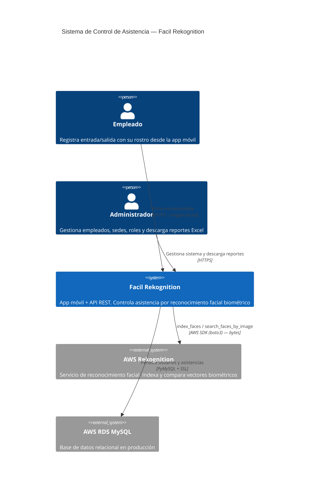
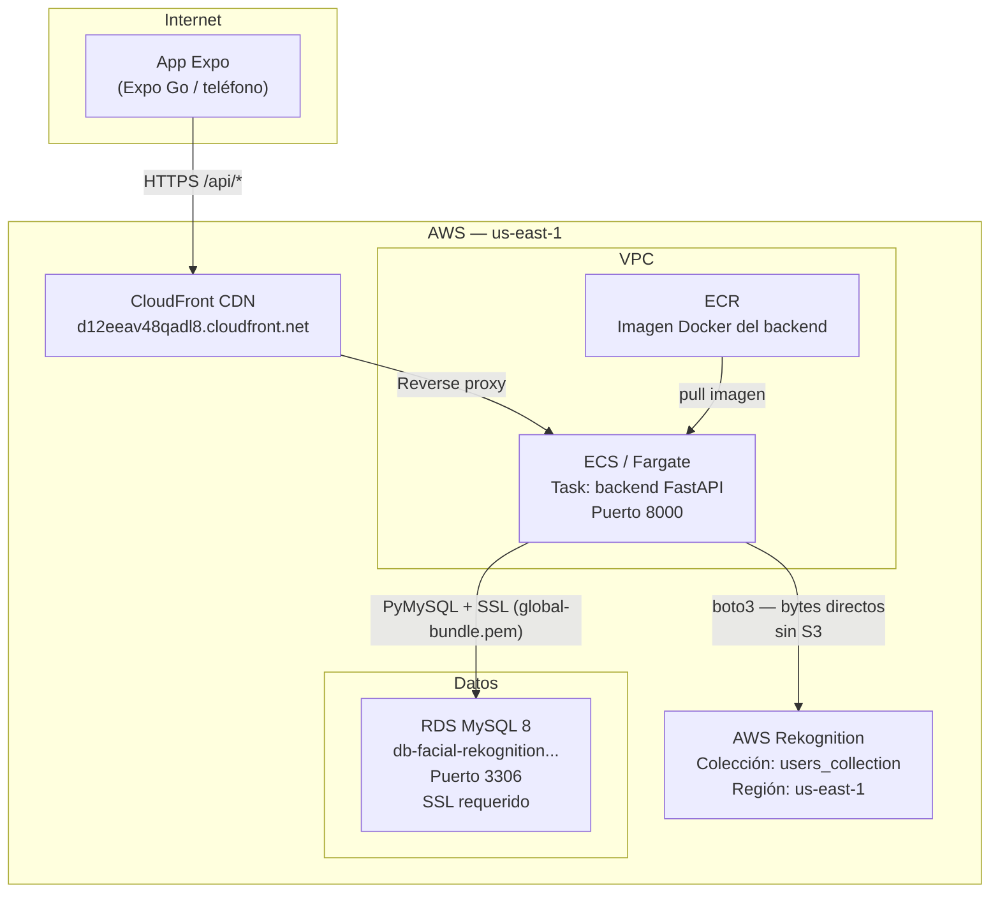
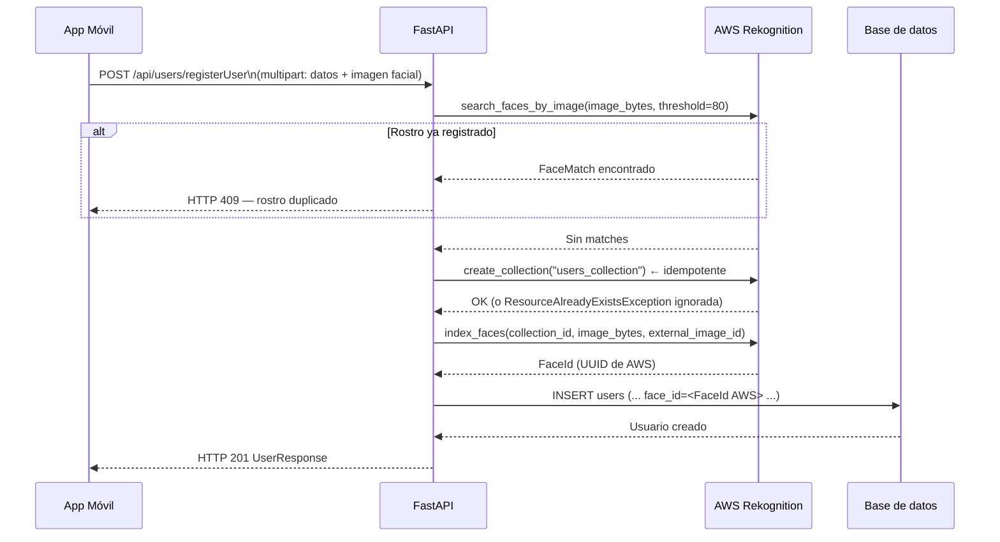
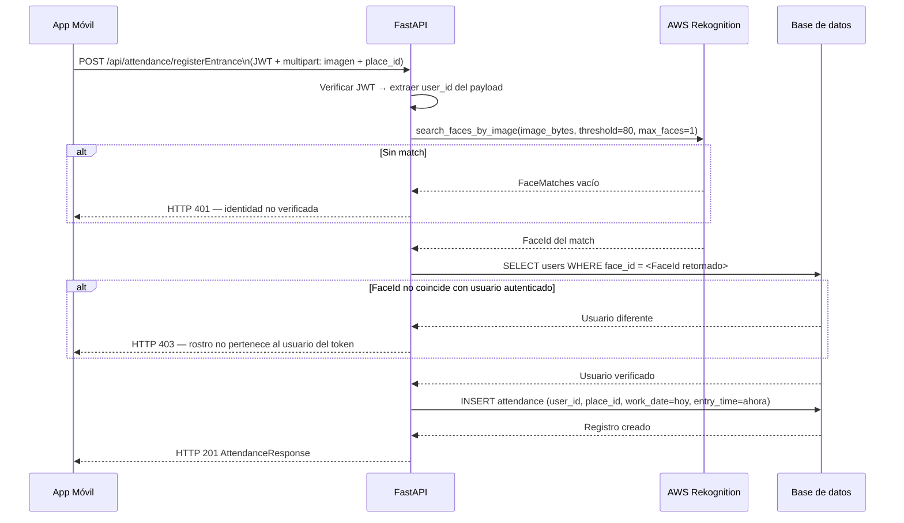

# Arquitectura — Facil Rekognition

Documento de referencia de la arquitectura del sistema. Cubre el diagrama de contexto, la topología de infraestructura AWS (cuando estaba activa), los flujos de datos principales y el modelo de seguridad.

---

## Diagrama de contexto del sistema



---

## Topología de infraestructura AWS (período activo)



> La cuenta AWS fue cerrada. Esta topología documenta el estado que estuvo activo, no el estado actual.

---

## Flujo completo: Registro de empleado



---

## Flujo completo: Verificación de asistencia (fichaje de entrada)



El fichaje de **salida** sigue el mismo flujo de verificación facial, pero en lugar de INSERT hace UPDATE sobre el registro de entrada abierto: actualiza `exit_time` y calcula `total_hours`.

---

## Modelo de seguridad

### Autenticación

| Mecanismo | Implementación | Notas |
|---|---|---|
| Login facial | AWS Rekognition `search_faces_by_image` → FaceId → JWT | Umbral de similitud: 80% |
| Login manual | Email + password → Argon2 verify → JWT | `passlib` con `argon2-cffi` |
| Token | JWT HS256, expiración 60 min | Firmado con `JWT_SECRET_KEY` del entorno |
| Transporte del token | `Authorization: Bearer <token>` | Interceptor axios en el cliente |

### Autorización

FastAPI usa dependencias inyectables para proteger rutas:

```
get_current_user   ← decodifica y valida el JWT en cada request
require_roles()    ← verifica que el campo "role" del payload sea el requerido
```

Ejemplo de ruta protegida:
```python
@router.get('/getAllUsers', dependencies=[Depends(require_roles('admin'))])
```

### Credenciales AWS

En producción (ECS): las credenciales se proveen vía **IAM Task Role** asignado al task de ECS. `boto3` las resuelve automáticamente desde el metadata endpoint del contenedor — no se necesitan env vars `AWS_ACCESS_KEY_ID` / `AWS_SECRET_ACCESS_KEY`.

En desarrollo local: usar `~/.aws/credentials` o las variables de entorno.

### Almacenamiento en el cliente

El JWT, el rol y el `user_id` se almacenan con **`expo-secure-store`** (Keychain en iOS, Keystore en Android). No se usa `AsyncStorage` ni `localStorage`.

---

## Limitaciones de la arquitectura

### Sin sistema de migraciones (Alembic)

El esquema se crea con `Base.metadata.create_all(bind=engine)` al arrancar el servidor. Esto funciona correctamente para la creación inicial pero **no aplica cambios** en tablas existentes. Cualquier modificación de modelo en producción requiere:

1. Modificar la tabla manualmente en RDS, o
2. Recrear la base de datos (pérdida de datos).

La solución correcta es Alembic con migraciones versionadas.

### Geofencing no aplicado

El modelo `Place` almacena `latitude`, `longitude` y `radius_meters` con la intención de validar que el empleado esté físicamente en la sede al fichar. Esta validación **nunca se implementó** en `AttendanceService`. Los datos existen en la tabla pero no tienen efecto en el flujo de negocio.

### `RekognitionService` sin singleton

`RekognitionService.__init__` crea un cliente `boto3` nuevo en cada instanciación. En el código actual, el servicio se instancia por request. Para producción real, debería ser un singleton inyectado o instanciarse una vez al arrancar la app.

### Sin CI/CD ni IaC

Los deploys a ECS fueron manuales (build de imagen → push a ECR → actualización del task). No existe ningún archivo de pipeline (`.github/workflows/`, `buildspec.yml`) ni de infraestructura como código (Terraform, CDK). La infraestructura AWS no es reproducible a partir del repositorio.

### Frontend sin deploy resuelto

El Dockerfile de Expo en `facial_prod` no produce un artefacto distribuible para dispositivos móviles. Expo en producción requiere **EAS Build** (genera `.apk` / `.ipa`) y opcionalmente **EAS Update** para actualizaciones OTA. El frontend se usó exclusivamente vía Expo Go durante el demo.

### CORS abierto

`main.py` configura `allow_origins=["*"]`. En producción debería restringirse al dominio de CloudFront:

```python
allow_origins=["https://d12eeav48qadl8.cloudfront.net"]
```
